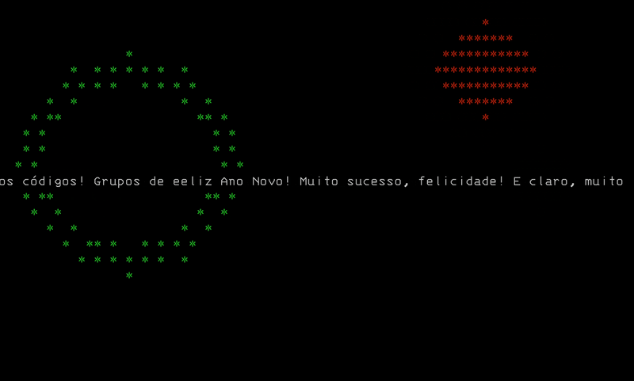

# Feliz Ano Novo!



Alem de comemorar o ano novo este exemplo mostra como usar o terminal e goroutines para criar um efeito de fogos de artificio.

Um ano novo cheio de sucesso, felicidade e muitos códigos!

## Como rodar

```bash
go run main.go
```

